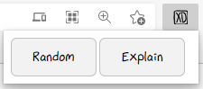

# xkcd-plz

This extension for Chrome/Edge support a convenient way to show a random xkcd page and explain it. 

[The font](font/xkcd-script.ttf) used in this extension is cloned from the repo [ipython/xkcd-font](https://github.com/ipython/xkcd-font).

